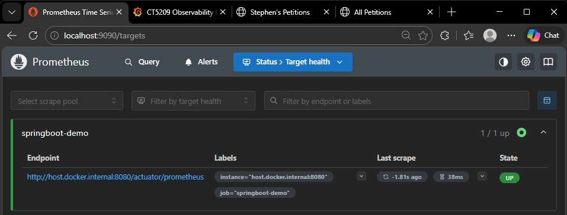
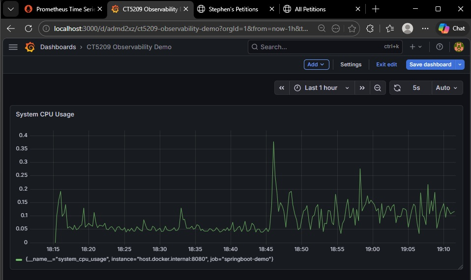
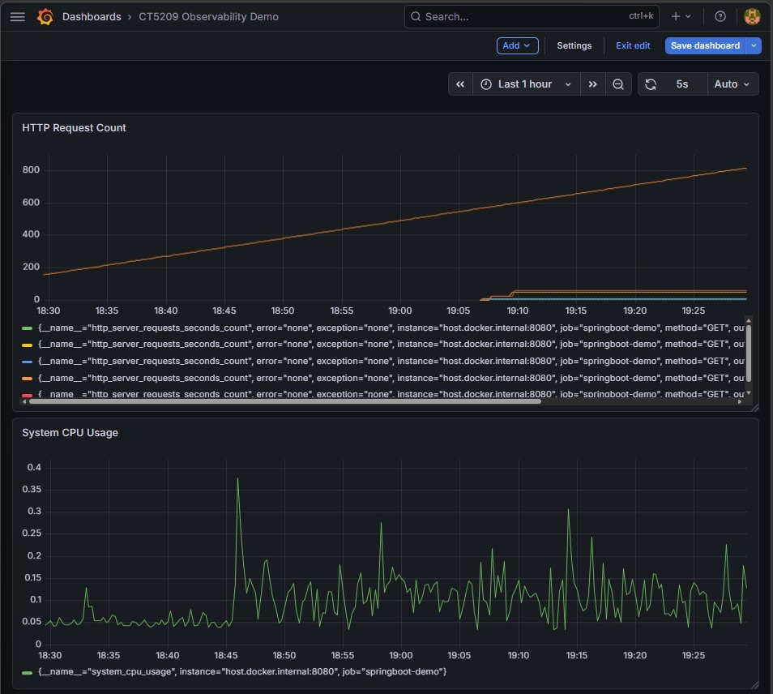
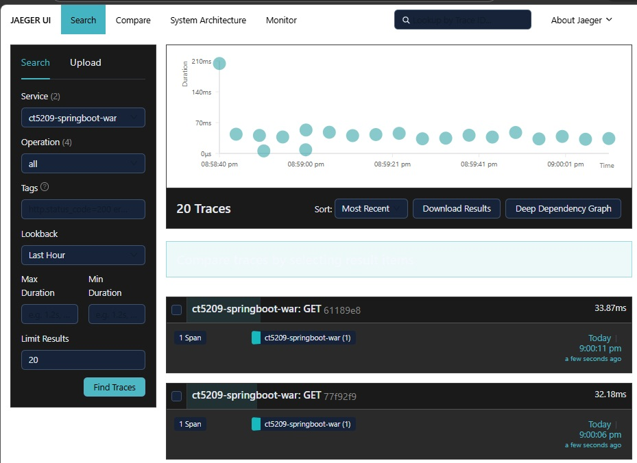
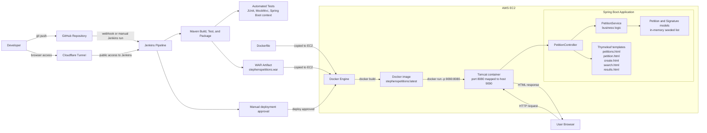

# Stephen's Petitions App

## Overview

Stephen's Petitions is a Spring Boot web application for creating, viewing, searching, and signing petitions.

It was developed as part of the CT5209 Cloud DevOps module and demonstrates a Continuous Integration and Continuous Deployment (CI/CD) workflow using GitHub, Jenkins, Maven, Docker, and deployment to a Dockerized Apache Tomcat container on Amazon Web Services (AWS) Elastic Compute Cloud (EC2).

> **For reviewers:** Start with **[v1.2.0 – Review Snapshot](https://github.com/sdaly-ie/ct5209-springboot-war/releases/tag/v1.2.0)** for the stable assessed snapshot.  
> The `main` branch may include later refinements or documentation updates.  
> Initial release snapshot: **v1.0.0**

### What's new in v1.2.0

The following improvements were bundled into v1.2.0:

- Added Spring Boot Actuator and Micrometer Prometheus registry
- Exposed `/actuator/health` and `/actuator/prometheus`
- Added Prometheus scrape configuration under `observability/prometheus.yml`
- Added Docker Compose services for Prometheus, Grafana, and Jaeger
- Added OpenTelemetry Spring Boot starter for automatic tracing
- Configured OTLP trace export from the application to Jaeger
- Added observability evidence screenshots for Prometheus, Grafana, and Jaeger
- Expanded the README to document the local observability workflow

### Release history

- **[v1.1.0 – Review Snapshot](../../releases/tag/v1.1.0)**  
  Stable assessed snapshot with Dockerized Apache Tomcat deployment on AWS EC2, a refined Jenkins pipeline, improved README deployment evidence, refreshed Jenkins screenshots, and a clearer empty-state message on the search results page.

- **[v1.0.0 – Stable CI/CD Release for Petitions App](../../releases/tag/v1.0.0)**  
  Initial stable release of the Spring Boot petitions app with Thymeleaf UI, JUnit and MockMvc testing, WAR packaging, Jenkins-based CI/CD, and deployment to Apache Tomcat on AWS EC2.

## Live Application

- Application URL: http://13.49.44.175:9090/stephenspetitions/

## Features

- Create a petition
- View all petitions
- View petition details
- Sign a petition with name and email
- Search petitions by keyword
- Landing page with navigation

## Tech Stack

- Java 17
- Spring Boot
- Thymeleaf
- Maven
- JUnit and MockMvc
- Jenkins
- GitHub
- Docker
- Apache Tomcat 10
- AWS EC2
- Cloudflare Tunnel

## Observability

The project now includes a local observability demo using Spring Boot Actuator, Prometheus, Grafana, OpenTelemetry, and Jaeger.

### What was added

- Spring Boot Actuator and Micrometer Prometheus registry
- `/actuator/health` and `/actuator/prometheus` endpoints
- Prometheus scrape configuration under `observability/prometheus.yml`
- Prometheus, Grafana, and Jaeger services defined in `observability/docker-compose.yml`
- OpenTelemetry Spring Boot starter for automatic tracing
- OTLP trace export from the application to Jaeger
- Manual Grafana dashboard creation using Prometheus as the data source

### What this demonstrates

- Application metrics exposure from Spring Boot
- Prometheus scraping of live application metrics
- Grafana dashboard visualisation for operational monitoring
- Automatic HTTP request tracing with OpenTelemetry
- Trace collection and search in Jaeger
- A practical first step into observability for Java and platform-oriented roles

### Evidence

Prometheus target status:



Grafana dashboard - System CPU Usage:



Grafana dashboard - Two panels:



Jaeger trace proof:



### Observability quick start

The observability setup is local only and is not part of the EC2 deployment shown elsewhere in this project.

The observability stack is intended for local demonstration and learning. It uses Prometheus, Grafana, and Jaeger alongside the Spring Boot application.

#### Local prerequisites

To run these checks locally, make sure the following are installed and working on your machine:

- **Java 17**  
  Required to run the Spring Boot application.

- **Docker Desktop**  
  Required to run Prometheus, Grafana, and Jaeger from `observability/docker-compose.yml`.

- **A web browser**  
  Required to open the application, Prometheus, Grafana, and Jaeger locally.

- **Internet access for the first Docker pull**  
  Docker may need to download the container images the first time you run the observability stack.

You do **not** need to install Maven separately because this project includes the Maven Wrapper:

- `mvnw.cmd` for Windows
- `mvnw` for macOS / Linux

#### Recommended local checks before starting

From the project root, you can verify the basics with the following commands.

##### Windows PowerShell

```powershell
java -version
docker version
```

##### macOS / Linux

```bash
java -version
docker version
```

Expected outcome:

- `java -version` should show **Java 17**
- `docker version` should return both **Client** and **Server**

#### Start the observability services

From the project root, run:

##### Windows PowerShell

```powershell
docker compose -f observability/docker-compose.yml up -d
```

##### macOS / Linux

```bash
docker compose -f observability/docker-compose.yml up -d
```

This starts:

- Prometheus on `http://localhost:9090`
- Grafana on `http://localhost:3000`
- Jaeger on `http://localhost:16686`

Grafana default local demo credentials for a fresh container startup:

- Username: `admin`
- Password: `admin`

On first login to a fresh Grafana instance, Grafana may prompt you to change the default password.

#### Start the Spring Boot application

From the project root, run:

##### Windows PowerShell

```powershell
.\mvnw.cmd spring-boot:run
```

##### macOS / Linux

```bash
./mvnw spring-boot:run
```

The application runs locally on:

```text
http://localhost:8080
```

Useful local routes for generating requests and traces:

```text
http://localhost:8080/petitions
http://localhost:8080/create
http://localhost:8080/search
```

#### Verify metrics

Open:

```text
http://localhost:8080/actuator/health
http://localhost:8080/actuator/prometheus
```

Then open Prometheus and confirm the Spring Boot application target is up:

```text
http://localhost:9090
```

#### Verify traces

Open Jaeger:

```text
http://localhost:16686
```

Select the service:

```text
ct5209-springboot-war
```

Then visit a few application routes such as `/petitions`, `/create`, and `/search`.

Return to Jaeger and click **Find Traces**.

Open one returned trace to confirm the request spans are visible.

#### Stop the observability services

When finished, stop the local observability stack with:

##### Windows PowerShell / macOS / Linux

```bash
docker compose -f observability/docker-compose.yml down
```

## Architecture

The diagram below shows the application runtime flow and the CI/CD path used to build, test, package, and deploy the application.



## Project Structure

```text
src/main/java/com/example/demo
├── controller   # Web layer (PetitionController)
├── service      # Business logic (PetitionService)
└── model        # Domain objects (Petition, Signature)

src/test/java/com/example/demo
├── PetitionControllerTest
├── PetitionServiceTest
└── DemoApplicationTests

repo root
├── Jenkinsfile
├── Dockerfile
├── pom.xml
└── README.md
```

## CI/CD Pipeline

Jenkins is used to automate the build, test, packaging, and deployment workflow for the project.

The repository contains a Jenkins pipeline in `Jenkinsfile` with the following stages: `GetProject`, `Build`, `Test`, `Package`, `Archive`, `ApproveDeploy`, and `Deploy`.

The pipeline workflow is:

1. Get the latest code from GitHub
2. Build the application with Maven
3. Run automated tests
4. Package the application as a WAR file
5. Archive the WAR artifact in Jenkins
6. Pause for manual deployment approval
7. Copy the Dockerfile and WAR file to EC2
8. Build a Docker image on EC2
9. Run the application as a Tomcat container on EC2

### Jenkins Access

Jenkins was made securely reachable from the internet using a Cloudflare Tunnel. This supported browser access to the Jenkins dashboard and webhook configuration without directly exposing the server through open inbound ports.

### Jenkins Pipeline Evidence

The screenshot below shows a successful Jenkins pipeline run from the `main` branch, including manual approval and Docker-based deployment to EC2.


## Testing

The project includes automated tests across multiple layers.

### Service tests

- Retrieve seeded petitions
- Search petitions by keyword
- Add a new petition
- Add a signature to a petition

### Controller test

- Verify the `/petitions` page loads successfully

### Application startup test

- Verify the Spring Boot application context loads

## How to Run Locally

The application can be started locally using the Maven wrapper from the project root directory.

Open a terminal in the project root directory and run:

### Windows PowerShell

```powershell
.\mvnw.cmd spring-boot:run
```

### macOS / Linux

```bash
./mvnw spring-boot:run
```

Then open:

```text
http://localhost:8080/
```

Useful local routes:

```text
http://localhost:8080/petitions
http://localhost:8080/create
http://localhost:8080/search
```

When run locally through Spring Boot, the application is served from the root context, for example `/petitions`.
When deployed as a WAR file inside Tomcat on EC2, the WAR file name becomes the Tomcat context path, so the deployed application is reached under `/stephenspetitions`.

## Deployment

The deployed version runs in a Dockerized Apache Tomcat container on AWS EC2 and is updated through the Jenkins pipeline after manual approval.

Deployment flow:

- Code is pushed to GitHub, where Jenkins can be triggered by webhook or run manually from Jenkins
- Jenkins retrieves the latest code and runs build and test stages
- The application is packaged as `stephenspetitions.war`
- The WAR artifact is archived in Jenkins
- Deployment proceeds after manual approval
- Jenkins copies `Dockerfile` and `stephenspetitions.war` to the EC2 host
- Jenkins stops and disables the host-level `tomcat10` service to free port `9090` for the containerized deployment
- Jenkins builds the Docker image on EC2
- Jenkins runs the container with port mapping `9090:8080`

For the deployed version, the WAR file name provides the Tomcat context path, so the live application is reached at `/stephenspetitions` on port `9090`.

## Reviewer Quick Tour

This section provides a quick way to review the main features, structure, and deployment evidence of the project.

1. Open the live application
2. Use the navigation links to:
   - View all petitions
   - Create a petition
   - Search petitions
3. Open a petition and sign it
4. Review `Jenkinsfile` for the pipeline stages and deployment logic
5. Review `Dockerfile` for the Tomcat container image setup
6. Inspect the commit history to see iterative development
7. Review the architecture diagram and Jenkins pipeline evidence in this README

## Challenges and Reflection

This section summarises the main technical challenges encountered during development and what was learned from resolving them.

Key challenges included:

- Structuring the application pages and navigation cleanly
- Configuring Jenkins pipeline stages correctly
- Packaging the project as a WAR file for Tomcat deployment
- Converting the deployment flow from a host Tomcat service to a Dockerized Tomcat container on EC2
- Debugging GitHub webhook triggering and remote pipeline behaviour
- Validating manual deployment approval and deployment to AWS EC2
- Adding tests across service and controller layers while keeping the application stable

This project provided practical experience in web development, Continuous Integration, Continuous Deployment, testing, containerized deployment, cloud deployment, and troubleshooting.

## Future Improvements

The following items outline realistic next steps to extend the application beyond the current scope.

- Add persistent database storage such as H2, MySQL, or AWS Relational Database Service (RDS)
- Improve the user interface styling and usability
- Expand controller and integration test coverage
- Add form validation and error handling
- Add authentication and user accounts
