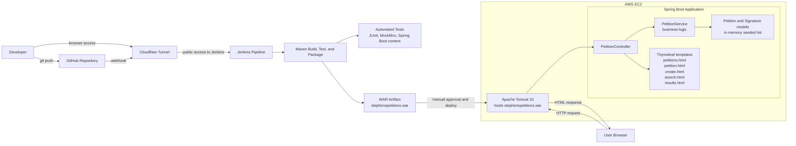
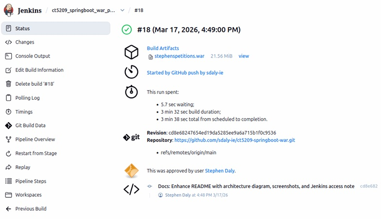

# Stephen's Petitions App (CT5209)

## Overview

Stephen's Petitions is a Spring Boot web application for creating, viewing, searching, and signing petitions.

It was developed as part of the CT5209 Cloud DevOps module and demonstrates a Continuous Integration and Continuous Deployment (CI/CD) workflow using GitHub, Jenkins, Maven, and deployment to Apache Tomcat on Amazon Web Services (AWS) Elastic Compute Cloud (EC2).

## Live Application

- Application URL: http://13.49.44.175:9090/stephenspetitions/

## Features

- Create a petition
- View all petitions
- View petition details
- Sign a petition with name and email
- Search petitions by keyword
- Landing page with navigation

## Tech Stack

- Java 17
- Spring Boot
- Thymeleaf
- Maven
- JUnit and MockMvc
- Jenkins
- GitHub
- Apache Tomcat 10
- AWS EC2
- Cloudflare Tunnel

## Project Structure

```text
src/main/java/com/example/demo
├── controller    # Web layer (PetitionController)
├── service       # Business logic (PetitionService)
└── model         # Domain objects (Petition, Signature)
```

## Architecture



## CI/CD Pipeline

The project uses a Jenkins pipeline defined in the repository `Jenkinsfile`.

Pipeline stages:

1. Get the code from GitHub
2. Build the application with Maven
3. Run automated tests
4. Package the application as a WAR file
5. Archive the WAR artifact in Jenkins
6. Pause for manual deployment approval
7. Deploy the WAR file to Apache Tomcat on AWS EC2

### Jenkins note

A Jenkins instance was used to run the pipeline and verify webhook-triggered builds and manual deployment approval.

Direct Jenkins access may require authentication, so the main evidence of the pipeline is provided through:

- the `Jenkinsfile` in this repository
- the report screenshots

## Jenkins Access

A Cloudflare Tunnel was used to make the Jenkins server securely reachable from the internet. This allowed browser access to the Jenkins dashboard and supported webhook-based automation without directly exposing the server through open inbound ports.

### Jenkins Pipeline Evidence

#### Successful Pipeline Run


## Testing

The project includes automated tests across multiple layers.

### Service tests

- retrieve seeded petitions
- search petitions by keyword
- add a new petition
- add a signature to a petition

### Controller test

- verify the `/petitions` page loads successfully

### Application test

- verify the Spring Boot application context loads

## How to Run Locally

```bash
mvn spring-boot:run
```

Then open:

```text
http://localhost:8080/stephenspetitions
```

## Deployment

The application is packaged as a WAR file and deployed to a remote Apache Tomcat 10 server hosted on AWS EC2.

Deployment flow:

- code is pushed to GitHub
- Jenkins is triggered automatically by webhook
- Maven build and tests are executed
- the WAR file is packaged and archived
- deployment proceeds after manual approval
- the updated WAR is copied to the remote Tomcat webapps directory

## Reviewer Quick Tour

1. Open the live application
2. Use the navigation links to:
   - view all petitions
   - create a petition
   - search petitions
3. Open a petition and sign it
4. Review the `Jenkinsfile` for the pipeline stages
5. Inspect the commit history to see iterative development by feature
6. See the report and video for pipeline execution evidence

## Challenges and Reflection

Key challenges included:

- structuring the application pages and navigation cleanly
- configuring Jenkins pipeline stages correctly
- packaging the project as a WAR file for Tomcat deployment
- debugging GitHub webhook triggering and remote pipeline behaviour
- validating manual deployment approval and deployment to AWS EC2
- adding tests across service and controller layers while keeping the application stable

This project provided practical experience in web development, Continuous Integration, Continuous Deployment, testing, cloud deployment, and troubleshooting.

## Future Improvements

- add persistent database storage such as H2, MySQL, or AWS Relational Database Service (RDS)
- improve the user interface styling and usability
- expand controller and integration test coverage
- add form validation and error handling
- add authentication and user accounts

## Author

Stephen Daly
