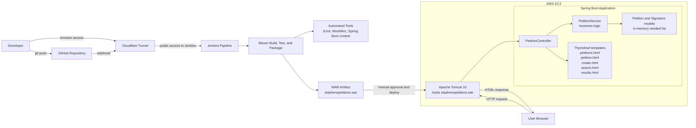

# Stephen's Petitions App

## Overview

Stephen's Petitions is a Spring Boot web application for creating, viewing, searching, and signing petitions.

It was developed as part of the CT5209 Cloud DevOps module and demonstrates a Continuous Integration and Continuous Deployment (CI/CD) workflow using GitHub, Jenkins, Maven, and deployment to Apache Tomcat on Amazon Web Services (AWS) Elastic Compute Cloud (EC2).

## Live Application

- Application URL: http://13.49.44.175:9090/stephenspetitions/

## Features

- Create a petition
- View all petitions
- View petition details
- Sign a petition with name and email
- Search petitions by keyword
- Landing page with navigation

## Tech Stack

- Java 17
- Spring Boot
- Thymeleaf
- Maven
- JUnit and MockMvc
- Jenkins
- GitHub
- Apache Tomcat 10
- AWS EC2
- Cloudflare Tunnel

## Architecture

The diagram below shows the application runtime flow and the CI/CD path used to build, test, package, and deploy the application.



## Project Structure

```text
src/main/java/com/example/demo
├── controller    # Web layer (PetitionController)
├── service       # Business logic (PetitionService)
└── model         # Domain objects (Petition, Signature)
```

## CI/CD Pipeline

Jenkins is used to automate the build, test, packaging, and deployment workflow after code is pushed to GitHub.

The project uses a Jenkins pipeline defined in the repository `Jenkinsfile`.

Each push to the repository can trigger the pipeline through a GitHub webhook. The pipeline then:

1. Gets the latest code from GitHub
2. Builds the application with Maven
3. Runs automated tests
4. Packages the application as a WAR file
5. Archives the WAR artifact in Jenkins
6. Pauses for manual deployment approval
7. Deploys the WAR file to Apache Tomcat on AWS EC2

### Jenkins Access

Jenkins was made securely reachable from the internet using a Cloudflare Tunnel. This supported browser access to the Jenkins dashboard and webhook-based automation without directly exposing the server through open inbound ports.

### Jenkins Pipeline Evidence

The screenshot below shows a successful Jenkins pipeline run, including artifact creation and recorded deployment approval.


## Testing

The project includes automated tests across multiple layers.

### Service tests

- Retrieve seeded petitions
- Search petitions by keyword
- Add a new petition
- Add a signature to a petition

### Controller test

- Verify the `/petitions` page loads successfully

### Application startup test

- Verify the Spring Boot application context loads

## How to Run Locally

The application can be started locally using the Maven wrapper from the project root directory. Open a terminal in the project root directory and run:

### Windows PowerShell

```powershell
.\mvnw.cmd spring-boot:run
```

### macOS / Linux

```bash
./mvnw spring-boot:run
```

Then open:

```text
http://localhost:8080/
```

Useful local routes:

```text
http://localhost:8080/petitions
http://localhost:8080/create
http://localhost:8080/search
```

## Deployment

The deployed version runs on Apache Tomcat 10 on AWS EC2 and is updated through the Jenkins pipeline after manual approval.

Deployment flow:

- Code is pushed to GitHub
- Jenkins is triggered automatically by webhook
- Maven builds and tests are executed
- The WAR file is packaged and archived
- Deployment proceeds after manual approval
- The updated WAR is copied to the remote Tomcat webapps directory

For the deployed version, the WAR file name provides the Tomcat context path, so the live application is reached at `/stephenspetitions` on port `9090`.

## Reviewer Quick Tour

This section provides a quick way to review the main features, structure, and deployment evidence of the project.

1. Open the live application
2. Use the navigation links to:
   - View all petitions
   - Create a petition
   - Search petitions
3. Open a petition and sign it
4. Review the `Jenkinsfile` for the pipeline stages
5. Inspect the commit history to see iterative development by feature
6. Review the architecture diagram and Jenkins pipeline evidence in this README

## Challenges and Reflection

This section summarises the main technical challenges encountered during development and what was learned from resolving them.

Key challenges included:

- Structuring the application pages and navigation cleanly
- Configuring Jenkins pipeline stages correctly
- Packaging the project as a WAR file for Tomcat deployment
- Debugging GitHub webhook triggering and remote pipeline behaviour
- Validating manual deployment approval and deployment to AWS EC2
- Adding tests across service and controller layers while keeping the application stable

This project provided practical experience in web development, Continuous Integration, Continuous Deployment, testing, cloud deployment, and troubleshooting.

## Future Improvements

The following items outline realistic next steps to extend the application beyond the current scope.

- Add persistent database storage such as H2, MySQL, or AWS Relational Database Service (RDS)
- Improve the user interface styling and usability
- Expand controller and integration test coverage
- Add form validation and error handling
- Add authentication and user accounts

## Author

Stephen Daly